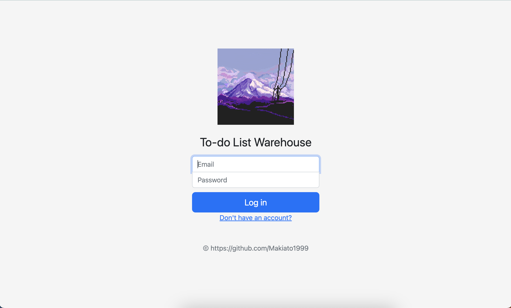
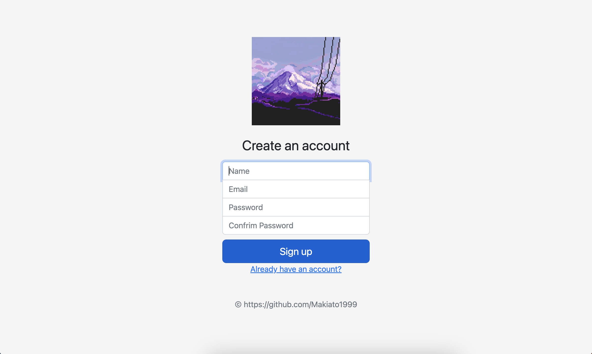
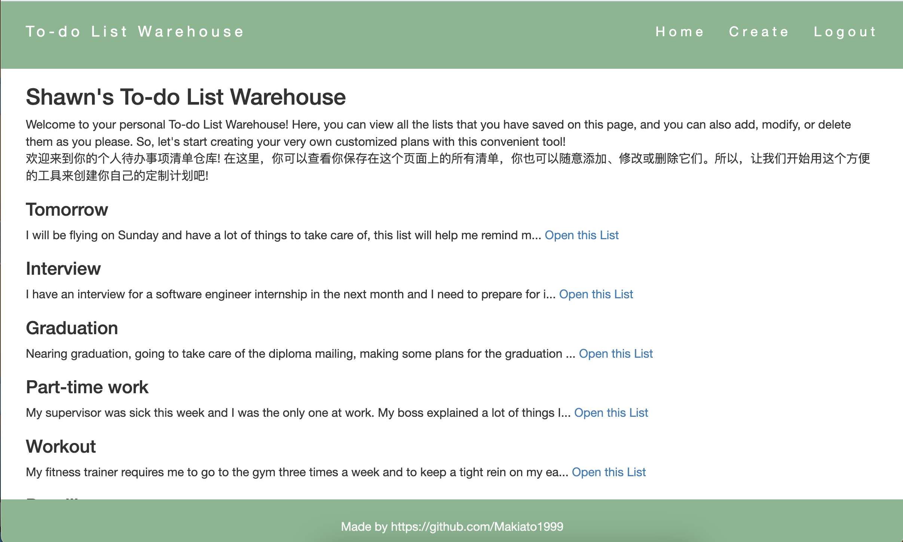
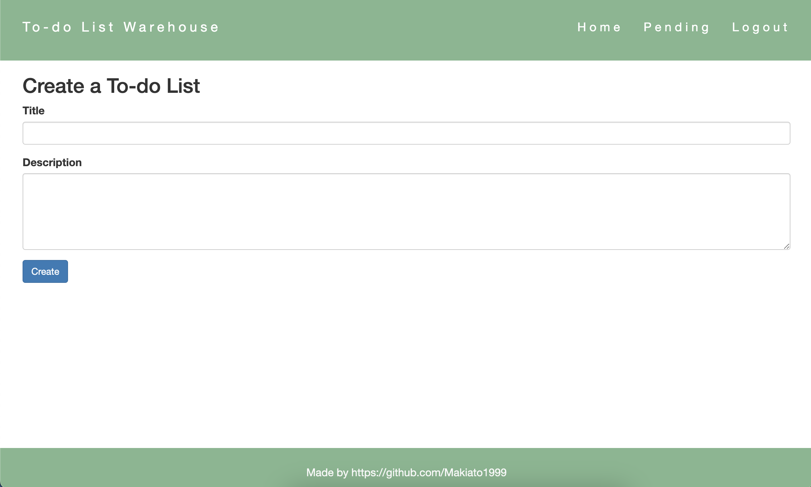
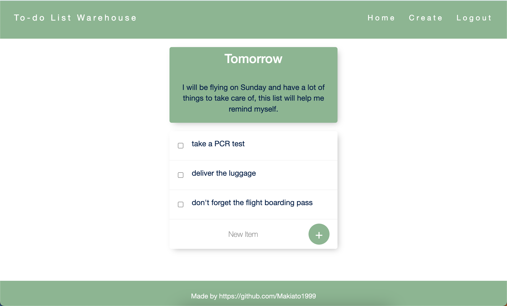

# Todo-List-Warehouse
Welcome to your personal To-do List Warehouse! Here, you can view all the lists that you have saved on this page, and you can also add, modify, or delete them as you please. So, let's start creating your very own customized plans with this convenient tool!
<br>
欢迎来到你的个人待办事项清单仓库! 在这里，你可以查看你保存在这个页面上的所有清单，你也可以随意添加、修改或删除它们。所以，让我们开始用这个方便的工具来创建你自己的定制计划吧!

### demo







## How to access this app
1. access this app by the url
    ```
    ```
## How to run this app on local server and local database
1. create connection to local database
    ```
    mongod --config /usr/local/etc/mongod.conf
    ```
2. run this app on local server with port 3000
    ```
    node app.js
    ```
3. access this app by the url
    ```
    http://localhost:3000/
    ```
